# Các kỹ thuật RAG nâng cao

## Context enrichment
### Overview
Nâng cao hiệu quả của truy xuất bằng cách mở rộng các câu liền kề.
Truy xuất các khối đã được nhúng, đồng thời lấy 2 khối liền kề chúng.

## Fusion Retrieval
## Overview
Kết hợp truy vấn dựa trên độ tương đồng cosin và điểm số khớp từ khóa BM25

## Reranking
## Overview

### Method details
1. Bộ truy xuất ban đầu
2. Mô hình reranking"
* Sử dụng LLM để đánh giá độ phù hợp

**Prompt:** 

    On a scale of 1-10, rate the relevance of the following document to the query. Consider the specific context and intent of the query, not just keyword matches. 

    Query: {query}
    
    Document: {doc}

    Relevance Score:"""

* Sử dụng mô hình cross-encoder đưa trực tiếp các cặp truy vấn-tài liệu vào mô hình, đầu ra là điểm số

## Query Transformations

### Overview
Sửa đổi và mở rộng truy vấn để nâng cao hiệu suất

### Method Details
Biến đổi các truy vấn ban đầu thành các truy vấn tốt hơn. Xử lý các truy vấn phức tạp hoặc mơ hồ. Định dang lại các truy vấn để phù hợp hơn với các tài liệu liên quan
Ba kỹ thuật biến đổi truy vấn để nâng cao quá trình truy xuất 

1. Rewrite
2. Step-back prompt
3. Sub-query decomposition

#### Rewrite
Sử dụng LLM để viết lại truy vấn chi tiết hơn.

**Prompt:** 

    You are an AI assistant tasked with reformulating user queries to improve retrieval in a RAG system. 
    Given the original query, rewrite it to be more specific, detailed, and likely to retrieve relevant information.

    Original query: {original_query}

    Rewritten query:

#### Step-back prompt
Sử dụng LLM để tạo ra truy vấn tổng quát hơn 

**Prompt:** 

    You are an AI assistant tasked with reformulating user queries to improve retrieval in a RAG system. 
    Given the original query, rewrite it to be more specific, detailed, and likely to retrieve relevant information.

    Original query: {original_query}

    Rewritten query:

#### Sub-query decomposition
Sử dụng LLM để phân tách truy vấn ban đầu thành nhiều truy vấn nhỏ hơn, mỗi truy vấn mang một ngữ nghĩa riêng.

**Prompt:** 
    You are an AI assistant tasked with breaking down complex queries into simpler sub-queries for a RAG system.
    Given the original query, decompose it into 2-4 simpler sub-queries that, when answered together, would provide a comprehensive response to the original query.

    Original query: {original_query}

    example: What are the impacts of climate change on the environment?

    Sub-queries:
    1. What are the impacts of climate change on biodiversity?
    2. How does climate change affect the oceans?
    3. What are the effects of climate change on agriculture?
    4. What are the impacts of climate change on human health?

## Hierachical Indices
### Overview
Tạo ra hệ thống phân cấp nhiều tầng để điều hướng và truy xuất kết quả đối với các tài liệu lớn

### Method details
1. Tài liệu ban đầu sẽ được chia ra các đoạn, với mỗi đoạn, sử dụng LLM để tóm tắt lại văn bản đoạn đó.
2. Hai vector DB được tạo: văn bản tóm tắt và văn bản chi tiết
3. Khi truy xuất thông tin, tìm top k văn bản trong các văn vản tóm tắt.
4. Với k văn bản vừa tìm lọc ra các văn bản trong kho các văn bản chi tiết.

## Hypothetical Question (HyDE)
### Overview
Chuyển đổi các câu hỏi truy vấn thành các tài liệu giả định chứa câu trả lời. Cải thiện nhược điểm với RAG có truy vấn ngắn và tài liệu dài. Mở rộng truy vấn thành một tài liệu giả định đầy đủ, có thể cải thiện sự phù hợp của việc truy xuất bằng cách làm cho biểu diễn tương tự với các biểu diễn trong vector DB

### Method details
Sử dụng LLM để tạo ra các tài liệu giả định
**Prompt template**
    Given the question '{query}', generate a hypothetical document that directly answers this question. The document should be detailed and in-depth. The document size has be exactly {chunk_size} characters

## Contextual Compression

### Overview
Nén ngữ cảnh trong hệ thống RAG, cải thiện sự phù hợp của thông tin truy xuất, chỉ trích xuất ra các phần liên quan của tài liệu, dẫn đến việc truy xuất thông tin hiệu quả hơn cũng khắc phục nhược điểm mất thổng tin với ngữ cảnh dài của các mô hình LLM (lost in the middle).

### Method details

1. Nhúng và lưu trữ tài liệu văn bản vào vector DB

2. Xây dựng bộ nén ngữ cảnh dựa trên LLM

3. Truy xuất thông tin kết hợp bộ nén ngữ cảnh để trích xuất ra những thông tin chính cho việc sinh phản hồi.

## Adaptive retrievals
### Overview
Phương pháp này điều chỉnh chiến lược sao cho phù hợp với từng loại truy vấn. Bốn chiến lược truy xuất thích ứng được đưa ra bao gồm:
1. Thực tế
2. Phân tích
3. Quan điểm 
4. Ngữ cảnh

### Method details 
1. Phân loại truy vấn
Sử dụng LLM để phân loại truy vấn thành 1 trong 4 dạng trên.
#### Prompt Template
    Classify the following query into one of these categories: Factual, Analytical, Opinion, or Contextual.
    
    Query: {query}
    
    Category:

2. Chiến lược cho từng dang truy vấn
* **Thực tế**

Dùng LLM để nâng cao truy vấn ban đầu:

**Prompt:** 

    Enhance this factual query for better information retrieval: {query}

* **Phân tích**
Tạo ra nhiều truy vấn con để bao quát hêt truy vấn chính

**Prompt:** 

    Generate {k} sub-questions for: {query}

* **Quan điểm**

Xác định các quan điểm khác nhau bằng LLM 

Truy xuất tài liệu cho từng quan điểm 

Sử dụng LLM để chọn các quan điểm từ tài liệu truy xuất
Identify {k} distinct viewpoints or perspectives on the topic: {query}

**Prompt:** 

viewpoints_prompt:

    Identify {k} distinct viewpoints or perspectives on the topic: {query}

opinion_prompt:

    Classify these documents into distinct opinions on '{query}' and select the {k} most representative and diverse viewpoints:

    Documents: {docs}

    Selected indices:

* **Ngữ cảnh**

Kết hợp ngữ cảnh cụ thể của người dùng vào truy vấn bằng cách sử dụng một LLM.
Thực hiện truy xuất dựa trên truy vấn có ngữ cảnh.

**Prompt:** 

    Given the user context: {context}
    Reformulate the query to best address the user's needs: {query}

## Graph RAG

### Over view
Đồ thị RAG xử lý tài liệu đầu vào để tạo ra một đồ thị kiến thức. Hệ thống biểu diễn kiến thức dưới dạng một đồ thị liên kết, cho phép duyệt thông tin thông minh hơn

### Method details

1. Xây dựng vector DB

2. Xây dựng đồ thị kiến thức 

   - Các nút đồ thị được tạo cho mỗi đoạn văn bản.

   - Các khái niệm được trích xuất từ mỗi đoạn bằng cách kết hợp các kỹ thuật NLP và mô hình ngôn ngữ.

   - Các khái niệm được trích xuất được lemmatize để cải thiện khả năng khớp.

   - Các cạnh được thêm vào giữa các nút dựa trên sự tương tự về ngữ nghĩa và các khái niệm chung.

   - Trọng số cạnh được tính toán để đại diện cho sức mạnh của mối quan hệ.

3. Xử lý Truy vấn:

   - Truy vấn của người dùng được nhúng và được sử dụng để truy xuất các tài liệu liên quan từ kho vector.

   - Một hàng đợi ưu tiên được khởi tạo với các nút tương ứng với các tài liệu liên quan nhất.

   - Hệ thống sử dụng một thuật toán tương tự Dijkstra để duyệt đồ thị kiến thức:

* Các nút được khám phá theo thứ tự ưu tiên của chúng (sức mạnh của kết nối với truy vấn).

* Đối với mỗi nút được khám phá:

       - Nội dung của nó được thêm vào ngữ cảnh.

       - Hệ thống kiểm tra xem ngữ cảnh hiện tại có cung cấp một câu trả lời đầy đủ hay không.

       - Nếu câu trả lời không đầy đủ:

* Các khái niệm của nút được xử lý và thêm vào một tập hợp các khái niệm đã truy cập.

* Các nút lân cận được khám phá, với trọng số của chúng được cập nhật dựa trên trọng số cạnh.

* Các nút được thêm vào hàng đợi ưu tiên nếu tìm thấy một kết nối mạnh hơn.

   - Quá trình này tiếp tục cho đến khi tìm thấy một câu trả lời đầy đủ hoặc hàng đợi ưu tiên cạn kiệt.

   - Nếu không tìm thấy câu trả lời đầy đủ sau khi duyệt đồ thị, hệ thống tạo ra một câu trả lời cuối cùng bằng cách sử dụng ngữ cảnh tích lũy và một mô hình ngôn ngữ lớn.

Hiển thị:

   - Đồ thị kiến thức được hiển thị với các nút đại diện cho các đoạn văn bản và các cạnh đại diện cho mối quan hệ.

   - Màu sắc của cạnh cho biết sức mạnh của mối quan hệ (trọng số).

   - Đường đi được duyệt để trả lời một truy vấn được tô sáng bằng các mũi tên cong, đứt nét.

   - Các nút bắt đầu và kết thúc của việc duyệt được tô màu rõ ràng để dễ dàng nhận dạng.

## Self-RAG
### Overview 
Self-RAG là kỹ thuật để hệ thống RAG quyết định có sử dụng thông tin đã truy xuất ra.

### Method details
1. Quyết định truy xuất

Prompt:

    Given the query '{query}', determine if retrieval is necessary. Output only 'Yes' or 'No'.

2. Truy xuất tài liệu và đánh giá sự liên quan

Truy xuất các tài liệu và dùng LLM để đánh giá sự liên quan

Prompt:

    Given the query '{query}' and the context '{context}', determine if the context is relevant. Output only 'Relevant' or 'Irrelevant'

3. Sinh câu trả lời, đánh giá độ hỗ trợ và tính hữu dụng của phản hồi được sinh ra

Support_prompt:

    Given the response '{response}' and the context '{context}', determine if the response is supported by the context. Output 'Fully supported', 'Partially supported', or 'No support'

Utility_Prompt:

    Given the query '{query}' and the response '{response}', rate the utility of the response from 1 to 5.

## Raptor

### Overview

Raptor là một hệ thống RAG kết hợp tóm tắt tài liệu theo cấp bậc, chuyên biệt xử lý cho các tài liệu lớn.

### Method details
1. Xây dựng cây phân cấp 

* Bắt đầu với level 0: nhúng tài liệu, phân cụm các tài liệu đã nhúng và tạo tóm tắt cho từng cụm

* Dùng những tóm tắt này làm văn bản cho level tiếp theo

2. Tiếp tục cho đến cấp độ tối đa hoặc chỉ còn một tóm tắt
