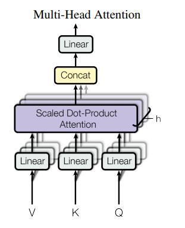
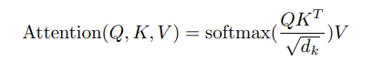
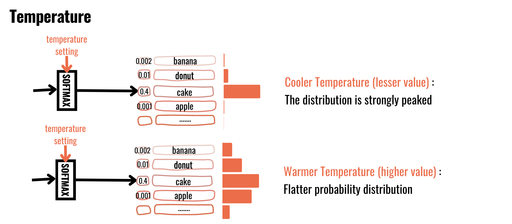
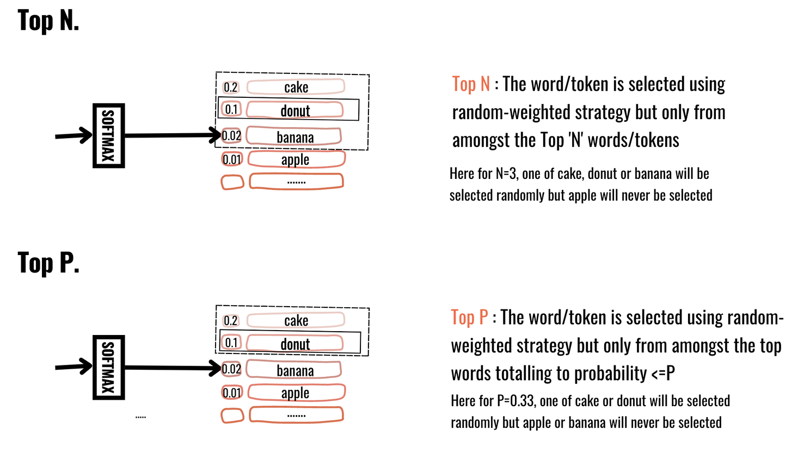
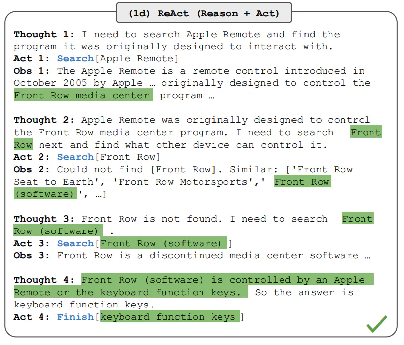
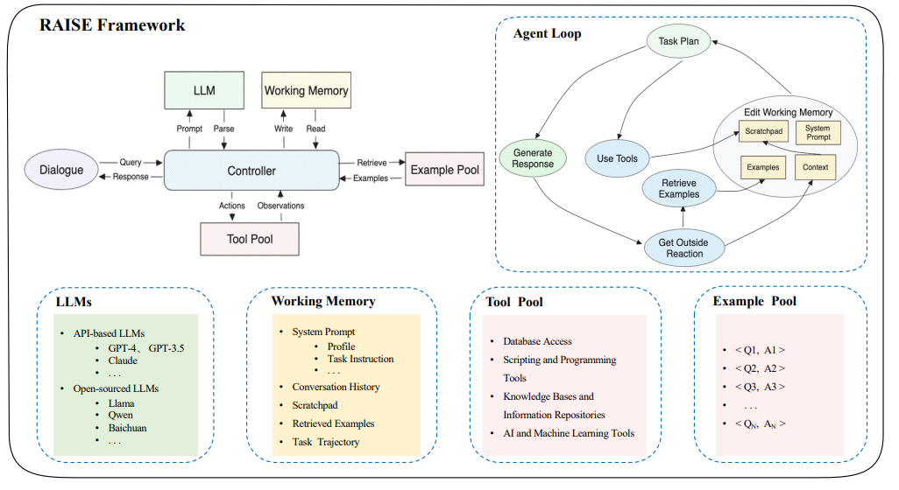
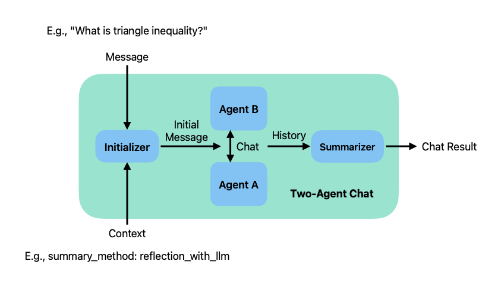
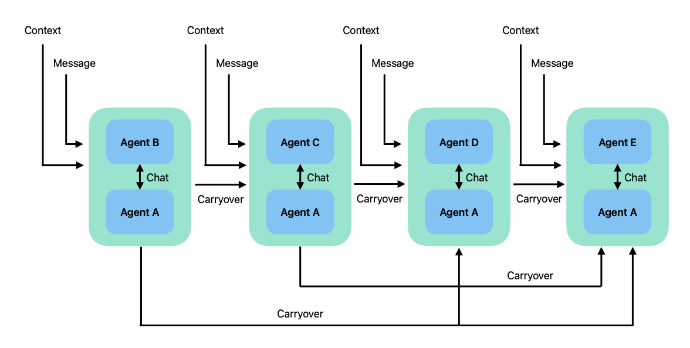
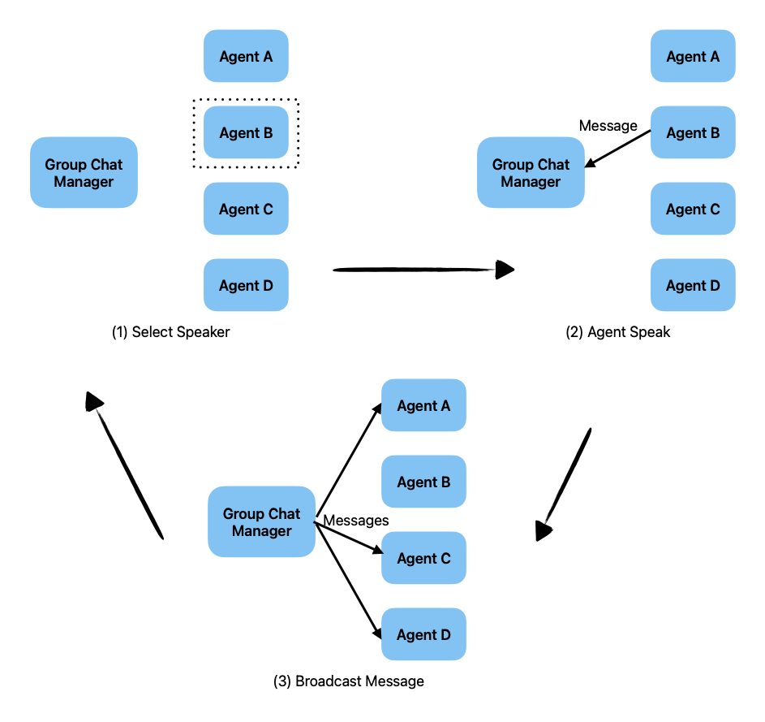

# Tổng quan về LLM
Large language model là một loại mô hình ngôn ngữ được đào tạo bằng cách sử dụng các kỹ thuật học sâu trên tập dữ liệu văn bản khổng lồ. Các mô hình này có khả năng tạo văn bản tương tự như con người và thực hiện các tác vụ xử lý ngôn ngữ tự nhiên khác nhau.

Kiến trúc của LLM chủ yếu bao gồm nhiều lớp mạng nơ-ron, như recurrent layers, feedforward layers, embedding layers, attention layers

# Nguyên lý hoạt động của LLM

LLM học hỏi từ khối lượng dữ liệu khổng lồ. Cốt lõi của LLM là kích thước của tập dữ liệu mà nó được đào tạo. Giờ đây, LLM thường được xây dựng dựa trên những bộ dữ liệu đủ lớn để bao gồm gần như mọi thứ đã được xuất bản trên internet trong một khoảng thời gian dài.

LLM được học từ một khối lượng rất lớn văn bản trước khi có thể ghi nhớ các quy luật và cấu trúc ngôn ngữ. Đây là nguyên nhân mấu chốt để LLM có thể hiểu và phản hồi theo ngữ cảnh một cách logic và mạch lạc.

1. **Kiến trúc Transformer**

Bao gồm hai thành phần encoder và decoder:

**Encoder**

Cơ chế multi head self-attention: 

Cơ chế cho phép tính trọng số cho mỗi cặp từ trong câu với bộ ba ma trận Query, Value, Key

Thực hiện với nhiều self-attention song song, mỗi bộ học một ngữ nghĩa khác nhau.

Cơ chế positional encoding để thêm thông tin về thứ tự của các token trong câu.

Feed-forwrad: sau khi tính toán attention đưa qua MLP dể lan truyền thông tin

**Decoder**
 
 Cơ chế self-attention như encoder nhưng thêm các ma trận mask để che các từ xuất hiện ở sau trong câu

# Các mô hình LLM nổi tiếng

* GPT-3 (Generative Pre-training Transformer 3)
* BERT (Bidirectional Encoder Representations from Transformers)
* T5 (Text-to-Text Transfer Transformer) – T5
* Meta Llama 3

# Các ưu điểm của LLM so với RNN truyền thống

Cơ chế attention cho thêm ngữ cảnh context vào trong câu. 

Có thể giải quyết vấn đề gradient vanishing và train tuần tự của RNN

Sử dụng các pretrained model để học chuyển giao trong NLP. Với RNN ta chỉ có thể kế thừa lại word embedding model, hay còn gọi là cách tiếp cận nông. Còn với kiến trức transformer ta ko chỉ chuyển giao đặc trưng và còn có thể học chuyển giao các layer sâu hơn của mô hình.

# Important parameters of LLM

1. **Context Window**

Tham số context window xác định số lượng token đầu vào mà mô hình sẽ sinh output. Điều chỉnh context window có thể kiểm soát mức độ ngữ cảnh mà mô hình xem xét khi tạo đầu ra. Context window nhỏ hơn tập trung vào ngữ cảnh ngay lập tức, trong khi context windown lớn hơn cung cấp ngữ cảnh rộng hơn. 

2. **Max Tokens**

Max tokens là tham số xác định số lượng token lớn nhất được sinh ra. 

3. **Temperature**

Temperature là tham số điều khiển độ randomize của output. Temperature nằm trong khoảng [0, 1], với t = 1 mô hình sẽ ngẫu nhiên và đa dạng khi sinh văn bản. Với t thấp hơn thì sẽ sinh ra những phản hổi chắc chắn hơn.

4. **Top P**

Top P còn được gọi là lấy mẫu xác suất, xác định phân bố xác suất tích lũy được sử dụng để sinh ra token tiếp theo. Ví dụ, với top p=0.9, mô hình sẽ chọn từ tập hợp các token mà tổng xác suất của chúng đạt 90%

5. **Top N**

Top N là tham số xác định số lượng token tiềm năng hàng đầu từ đó mô hình chọn lựa token tiếp theo. Ví dụ, top n=50 nghĩa là mô hình sẽ chọn token tiếp theo từ 50 token có xác suất cao nhất.

6. **Presence Penalty**

Presence penalty là tham số để ngăn model đề cập đến một từ nhất định ở output. Khác với frequency penalty, penalty bằng nhau với tất cả repeated token 

7. **Frequency Penalty**

Frequency penalty là tham số để điều chỉnh độ lặp từ ở output. Tham số này giúp sinh ra văn bản một cách đa dạng hơn

# Large Action Model

Large Action Model (LAM) là một kiến trúc mô hình lớn được thiết kế để xử lý các hành động (actions) phức tạp bằng cách chuyển ý định của con người thành hành động. 

Để đạt được mức độ ra quyết định phức tạp LAM sẽ học từ một lượng data khổng lồ với thông in hành động của người dùng.

### Context length

Độ dài ngữ cảnh là số lượng token mô hình sử dụng để dự đoán ra từ tiếp theo. Độ dài ngữ cảnh là yếu quan trọng vì nó quyết định khă năng hiểu ngữ cảnh, nắm bắt thông tin của mô hình.

## Cách tăng context length

Các hướng tiếp cận:
* AliBi method
* Position Interpolation
* NTK Interpolation 

LongLora: Efficient Fine-tuning of Long-context Large Language Models

# AI Agent

## ReAct & Raise

ReAct (reason + act) được lấy cảm hứng từ sự phối hợp giữa "action" và "reasoning", cho phép con người học các nhiệm vụ mới và đưa ra quyết định hoặc lý luận.

Prompt (CoT) đã cho thấy khả năng của LLM trong việc thực hiện truy vết lý luận nhằm tạo ra câu trả lời cho các câu hỏi liên quan đến lý luận số học, .., cùng với các nhiệm vụ khác. Nhưng việc thiếu khả năng tiếp cận với thế giới bên ngoài hoặc không có khả năng cập nhật kiến ​​thức có thể dẫn đến các vấn đề như ảo giác.

ReAct là một mô hình chung kết hợp lý luận và hành động với LLM. ReAct nhắc LLM tạo ra các dấu vết lý luận bằng lời nói và hành động cho một nhiệm vụ. Điều này cho phép hệ thống thực hiện lý luận để tạo, duy trì và điều chỉnh các kế hoạch hành động đồng thời cho phép tương tác với môi trường bên ngoài để kết hợp thông tin bổ sung vào lý luận.

Raise là cải tiến của ReAct, kết hợp một hệ thống bộ nhớ hai thành phần, phản chiếu trí nhớ ngắn hạn và dài hạn của con người, để duy trì bối cảnh và tính liên tục
trong các cuộc trò chuyện. Nó đòi hỏi một kịch bản xây dựng n toàn diện, bao gồm các giai đoạn như lựa chọn cuộc hội thoại, trích xuất ngữ cảnh, CoT và tăng cường ngữ cảnh

## Autogen

AutoGen là một khung cho phép phát triển các ứng dụng LLM bằng cách sử dụng nhiều tác tử có thể giao tiếp với nhau để giải quyết các nhiệm vụ. Các tác tử AutoGen có thể tùy chỉnh, có thể chuyển đổi và cho phép con người tham gia một cách liền mạch. Chúng có thể hoạt động ở nhiều chế độ khác nhau sử dụng kết hợp LLM, đầu vào của con người và công cụ.

**Chat termination**

Các tham số điều chỉnh chat termination:
* max_turns: giới hạn số lượng trả về
* max_consecutive_auto_reply: điều kiện kích hoạt termination nếu số lượt phản hồi từ 1 sender quá ngưỡng
* is_termination_msg: kích hoạt khi câu trả lời có chứa termination message

**Human Input Modes**

Ba chế độ cho human input:
* Never: không yêu cầu
* Terminate: human input yêu cầu khi terinatation được kích hoạt
* Always: luôn luôn yêu cầu request  

Two-Agent Chat and Chat Result

Sequential Chats

Group chat

Group chat manager dùng một số chiến lược để chọn tác tử tiếp theo:
* round robin
* random
* manual
* auto

Nested Chats

# Hệ sinh thái Hugging Face

Hugging Face là một công ty và nền tảng nổi tiếng trong lĩnh vực trí tuệ nhân tạo (AI). Hệ sinh thái của Hugging Face bao gồm nhiều công cụ, thư viện, và dịch vụ hỗ trợ việc phát triển và triển khai các mô hình AI.

**Thư viện Transformer**

Transformers là thư viện mã nguồn mở nổi tiếng nhất của Hugging Face. Nó cung cấp các mô hình học sâu (deep learning) cho nhiều nhiệm vụ NLP như dịch thuật, tóm tắt, trả lời câu hỏi, phân loại văn bản, ...

**Dataset**

Datasets là một thư viện mã nguồn mở khác của Hugging Face giúp dễ dàng tải, xử lý, và chia sẻ các tập dữ liệu.

Hơn 1000 tập dữ liệu: Cung cấp nhiều tập dữ liệu đa dạng cho các nhiệm vụ khác nhau như NLP, thị giác máy tính, ...

**Model HUb**

Model Hub là một kho lưu trữ lớn các mô hình AI được huấn luyện sẵn mà người dùng có thể tải về và sử dụng hoặc huấn luyện lại.

**API**

Hugging Face cung cấp các dịch vụ API để sử dụng các mô hình AI trong ứng dụng thực tế.

## Pretrained model

Pretrained models là các mô hình đã được huấn luyện trước trên một tập dữ liệu lớn và đa dạng. Mục đích của việc huấn luyện trước là để mô hình học các biểu diễn (representations) chung của dữ liệu, từ đó có thể được tinh chỉnh thêm cho các nhiệm vụ cụ thể hơn

## Supervised Fine-Tuning (SFT)

SFT là quá trình tinh chỉnh một mô hình pretrained cho một nhiệm vụ cụ thể bằng cách sử dụng một tập dữ liệu có gắn nhãn (labeled data).

## Reinforcement Learning with Human Feedback (RLHF)

RLHF là một phương pháp huấn luyện mô hình AI sử dụng học tăng cường kết hợp với phản hồi từ con người để cải thiện hiệu suất mô hình.

Các bước của RLHF:
* Sử dụng một pre-trained language model
* Thu thập dữ liệu train reward model
* Fine-tune LM băng reward model

Quá trình train reward model
* Thu thập data bằng nhiều LM khác nhau
* Sinh hàng loạt văn bản với cùng một prompt, con người đánh giá các văn bản này.
* Sử dụng PPO để để fine tune RL model

## GGUF

Llama.cpp là một dự án của Georgi Gerganov nhằm chuyển mô hình Llama sang C/C++. Điều này đã loại bỏ sự phức tạp do PyTorch giới thiệu và việc triển khai gốc cho phép thực hiện lượng tử hóa trực tiếp. Do đó, mô hình kết quả có thể chạy với lượng tử hóa số nguyên lên tới 4 bit, cho phép chạy các mô hình Llama có số lượng tham số cao mà không cần GPU chuyên dụng

GGUF là định dạng tệp của Llama.cpp để lưu trữ và truyền thông tin mô hình. Các mô hình lượng tử hóa được lưu trữ ở định dạng này để người dùng cuối có thể tải và chạy chúng. GGUF là định dạng kế thừa của GGML và nhằm mục đích cải thiện GGML bằng cách cung cấp nhiều khả năng mở rộng hơn, khả năng tương thích ngược và độ ổn định trong khi vẫn cho phép phát triển nhanh chóng.

