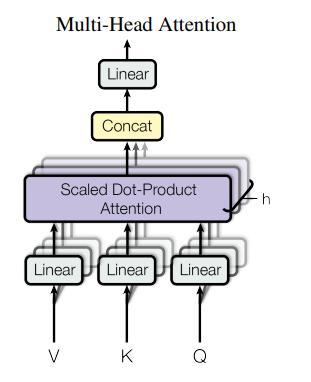
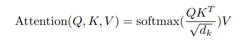

# Tổng quan về LLM
Large language model là một loại mô hình ngôn ngữ được đào tạo bằng cách sử dụng các kỹ thuật học sâu trên tập dữ liệu văn bản khổng lồ. Các mô hình này có khả năng tạo văn bản tương tự như con người và thực hiện các tác vụ xử lý ngôn ngữ tự nhiên khác nhau.

Kiến trúc của LLM chủ yếu bao gồm nhiều lớp mạng nơ-ron, như recurrent layers, feedforward layers, embedding layers, attention layers

# Nguyên lý hoạt động của LLM

LLM học hỏi từ khối lượng dữ liệu khổng lồ. Cốt lõi của LLM là kích thước của tập dữ liệu mà nó được đào tạo. Giờ đây, LLM thường được xây dựng dựa trên những bộ dữ liệu đủ lớn để bao gồm gần như mọi thứ đã được xuất bản trên internet trong một khoảng thời gian dài.

LLM được học từ một khối lượng rất lớn văn bản trước khi có thể ghi nhớ các quy luật và cấu trúc ngôn ngữ. Đây là nguyên nhân mấu chốt để LLM có thể hiểu và phản hồi theo ngữ cảnh một cách logic và mạch lạc.

1. **Kiến trúc Transformer**

Bao gồm hai thành phần encoder và decoder:

**Encoder**

Cơ chế multi head self-attention: 

Cơ chế cho phép tính trọng số cho mỗi cặp từ trong câu với bộ ba ma trận Query, Value, Key

Thực hiện với nhiều self-attention song song, mỗi bộ học một ngữ nghĩa khác nhau.

Cơ chế positional encoding để thêm thông tin về thứ tự của các token trong câu.

Feed-forwrad: sau khi tính toán attention đưa qua MLP dể lan truyền thông tin

**Decoder**
 
 Cơ chế self-attention như encoder nhưng thêm các ma trận mask để che các từ xuất hiện ở sau trong câu

# Các mô hình LLM nổi tiếng

* GPT-3 (Generative Pre-training Transformer 3)
* BERT (Bidirectional Encoder Representations from Transformers)
* T5 (Text-to-Text Transfer Transformer) – T5
* Meta Llama 3

# Các ưu điểm của LLM so với RNN truyền thống

Cơ chế attention cho thêm ngữ cảnh context vào trong câu. 

Có thể giải quyết vấn đề gradient vanishing và train tuần tự của RNN

Sử dụng các pretrained model để học chuyển giao trong NLP. Với RNN ta chỉ có thể kế thừa lại word embedding model, hay còn gọi là cách tiếp cận nông. Còn với kiến trức transformer ta ko chỉ chuyển giao đặc trưng và còn có thể học chuyển giao các layer sâu hơn của mô hình.